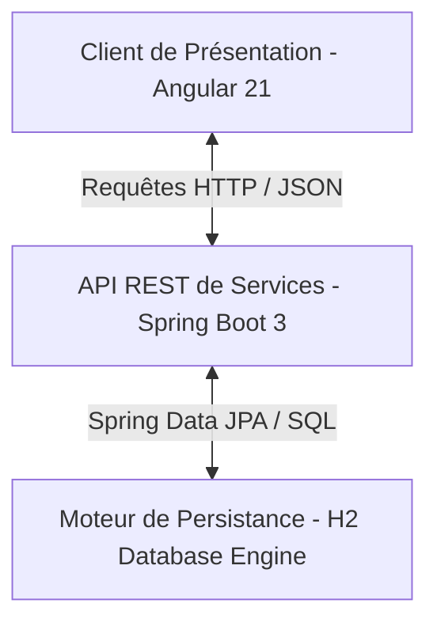
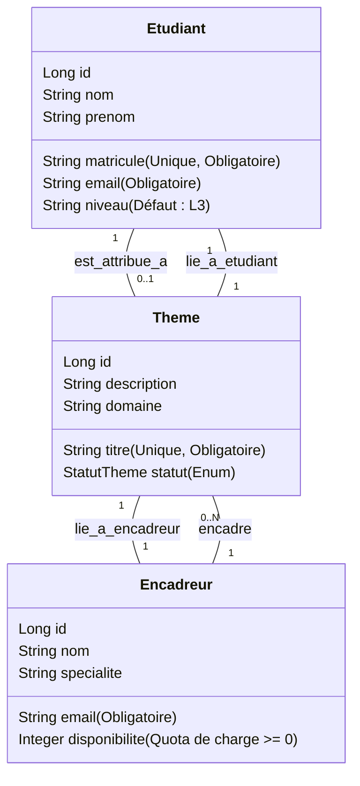

# 📝 Note de Conception Technique — LabéStages

**Projet :** LabéStages — Application de gestion des projets et stages de fin de cycle  
**Porteur :** Université de Labé (Département Informatique)  
**Auteur :** Département Informatique / Licence 3  
**Date :** Juillet 2026  
**Document :** Livrable L5 (Note de conception)

---

## 1. Architecture Client / Serveur

L'application **LabéStages** est bâtie sur une architecture découplée caractérisée par la séparation stricte des responsabilités entre le client de présentation, l'API de services et la couche de stockage.

### Justification de la séparation des couches :
1. **Séparation d'intérêts (Separation of Concerns)** : 
   * **Le Frontend Angular** est uniquement responsable de l'affichage, de l'expérience utilisateur, de la validation d'interface et du routage local (SPA). L'utilisateur bénéficie d'une navigation instantanée sans rechargement de page.
   * **Le Backend Spring Boot** centralise et applique de manière hermétique la logique métier (contrôle des règles d'attribution, contraintes de quotas, gestion des exceptions). Il n'a aucune connaissance de la façon dont les données sont affichées visuellement.
   * **La Base de données** est l'unique garante de la persistance, de la cohérence et de l'intégrité relationnelle des informations.
2. **Indépendance de déploiement et de scaling** : Le client web (statique) peut être déployé sur un CDN (comme Netlify ou Vercel), tandis que l'API de services peut être hébergée séparément sur un serveur d'application.
3. **Facilité de test et maintenance** : Chaque couche peut être testée de façon isolée (tests unitaires JUnit/MockMvc côté serveur, tests de composants et d'UI côté client).

---

## 2. Modèle de Données

Le modèle relationnel s'articule autour de trois entités fondamentales : l'**Étudiant**, l'**Encadreur** et le **Thème (projet)** de recherche.

### Justification des choix de relations :
* **Étudiant <-> Thème (Relation 1 - 0..1)** : Un étudiant de Licence 3 de l'Université de Labé ne peut travailler que sur un seul projet de fin de cycle à la fois. Un étudiant sans thème est représenté par l'absence d'association.
* **Encadreur -> Thème (Relation 1 - N)** : Un enseignant a une capacité de co-encadrement multiple. Il peut guider plusieurs équipes ou étudiants, dans la limite de son quota de `disponibilité`.
* **Thème -> (Étudiant, Encadreur) (Relations de dépendances obligatoires)** : Pour être valide, tout thème soumis doit obligatoirement être rattaché à un étudiant (le porteur) et à un enseignant désigné (l'encadreur référent). Les clés étrangères `etudiant_id` et `encadreur_id` sont donc non nulles au niveau de l'entité `Theme`.

---

## 3. Choix Techniques

### 3.1 La Base de données H2 (en mode fichier local)
* **Pourquoi H2 ?** Pour un déploiement académique ou une soutenance locale d'étudiants, l'installation d'un SGBD lourd (comme PostgreSQL ou MySQL) représente un verrou technique d'installation.
* **Pourquoi le mode fichier ?** Contrairement à une base en mémoire (`jdbc:h2:mem`) qui s'efface à chaque arrêt du serveur, nous avons configuré H2 en **mode stockage fichier** (`jdbc:h2:file:./data/labestagesdb`). Les enregistrements sont conservés localement dans le projet, permettant de reprendre le travail après un redémarrage, tout en gardant le projet portable.

### 3.2 L'utilisation des DTOs (Data Transfer Objects)
Plutôt que d'exposer directement nos entités JPA sur le réseau (ce qui poserait des risques de sécurité et de couplage), nous utilisons des DTOs :
* **Isolation structurale** : Empêche l'exposition des dépendances circulaires (Hibernate proxies) qui causent des erreurs de sérialisation JSON récurrentes.
* **Sécurité** : Contrôle exact des champs modifiables par le client (par exemple, ignorer les IDs système lors des requêtes POST).

### 3.3 Structure d'interface SPA (Sidebar + Sections)
* L'architecture avec une **Sidebar de navigation fixe à gauche** et une **section centrale dynamique** a été retenue pour maximiser l'espace d'affichage utile et offrir une expérience utilisateur similaire à celle d'un logiciel de bureau moderne.
* L'application fluide du Lazy Loading d'Angular permet d'isoler l'état d'affichage de chaque module (`Dashboard`, `Etudiant`, `Encadreur`, `Theme`) sans perturber le shell global de l'application.

---

## 4. Difficultés Techniques Rencontrées & Résolutions

### 4.1 Verrouillage Concurrent de la base H2 (Database Lock)
* **Description** : Lors de l'accès à la console H2 pour le débogage (sur `http://localhost:8080/h2-console`) en même temps que le serveur Spring Boot tournait, une erreur de type `Database lock acquired by another process` survenait fréquemment, empêchant l'application de démarrer.
* **Résolution** : Nous avons ajouté le paramètre `;AUTO_SERVER=TRUE` dans la chaîne de connexion JDBC (`spring.datasource.url`). Cela configure H2 pour qu'il agisse comme un serveur léger partagé, autorisant les connexions simultanées depuis le serveur d'application et la console Web.

### 4.2 Débordement d'affichage et barre de défilement horizontale sous Angular
* **Description** : Dans l'interface utilisateur, une barre de défilement horizontale inconfortable apparaissait sur toute l'application.
* **Résolution** : Le conteneur principal du layout utilisait `width: 100vw`. L'unité `vw` prend en compte toute la largeur de l'écran, y compris la zone réservée à la barre de défilement verticale du navigateur, ce qui créait un débordement artificiel de 15 à 17 pixels sur la droite. Remplacer `100vw` par `100%` a définitivement solutionné le décalage.

### 4.3 Blocage des requêtes HTTP (CORS Policy)
* **Description** : Au début de l'intégration, le navigateur bloquait toutes les requêtes du client Angular (port `4200`) vers l'API Spring Boot (port `8080`) au motif de la politique de sécurité de même origine (*Same-Origin Policy*).
* **Résolution** : Implémentation d'une configuration globale `WebMvcConfigurer` côté Spring Boot (dans la classe `CorsConfig`) pour déclarer explicitement le port local Angular comme origine valide autorisant les méthodes d'accès standards (`GET`, `POST`, `PUT`, `DELETE`).

### 4.4 Sérialisation JSON circulaire et exceptions d'incompatibilité de type
* **Description** : Lors du développement de l'entité complexe `Theme` liée à `Etudiant` et `Encadreur`, des exceptions de sérialisation infinie (`Infinite recursion`) survenaient dans l'API lors de la conversion des relations bidirectionnelles.
* **Résolution** : L'utilisation stricte de DTOs épurés a permis d'isoler les entités JPA. Le backend convertit désormais les entités en DTOs plats contenant uniquement les identifiants et les informations descriptives élémentaires des entités parentes avant tout envoi sur le réseau.
